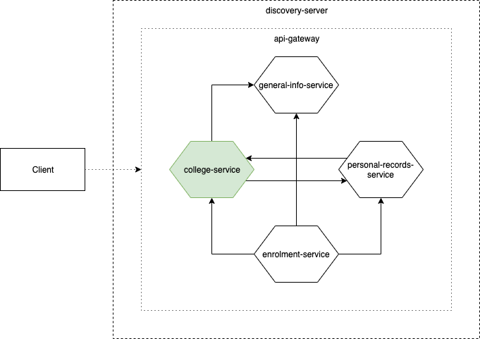

# 1. Overview
The college service is responsible for the domain of that of the colleges in the university, such as the College of Commerce and College of Engineering. The following are the data of which the college is responsible for:
1. College - information about the college itself
2. Degree - qualification chosen by and awarded to students for completing units from courses
3. Degree type - the type of degree to be completed, e.g. Bachelor's and Master's 
4. Course - a single subject to be completed within a school period to obtain units for a degree
5. Classroom - the classrooms the college own
6. Offering - a course set to be enrolled for a certain school period

This service uses [genuniv-common-service](https://github.com/carzanodev/genuniv-common-service) as its chassis.



# 2. Access Endpoints
1. `/api/v1/college`
2. `/api/v1/degree`
3. `/api/v1/degree-type`
4. `/api/v1/course`
5. `/api/v1/classroom`
6. `/api/v1/offering`

# 2.1. Course Specification
Course has a way for filtering its data, a very convenient feature for the frontend. This filtering makes use of `JpaSpecificationExecutor`. The following can be used in the params to filter course data:
1. `code`
2. `unit`
3. `lecturehours`
4. `labhours`
5. `collegeid`
6. `contains_name`
7. `contains_description`

Example Usage:
```json
curl http://localhost:18000/api/v1/course?contain_name=Basic&contain_description=Intro&unit=3&labhours=0&collegeid=1

{
    "response": {
        "courses": [
            {
                "id": 1,
                "code": "ENG101",
                "name": "Basic English",
                "description": "Intro to English",
                "unit": 3.0,
                "lecture_hours": 3,
                "lab_hours": 0,
                "college_id": 1
            }
        ]
    },
    "meta": {
        "message": "Query returned 1 results!",
        "timestamp": "2020-01-06T15:12:01.072+0000"
    }
}
```

# 3. Data Dependencies
The college service requests data from the following services via its APIs:
1. [general-info-service](https://github.com/carzanodev/genuniv-general-info-service)
    * School Year
    * School Period
    * Schedule
2. [personal-records-service](https://github.com/carzanodev/genuniv-personal-records-service)
    * Faculty
    
The retrieval of the data are done via a dedicated thread that periodically requests from the APIs. The data are also being cached afterwards.